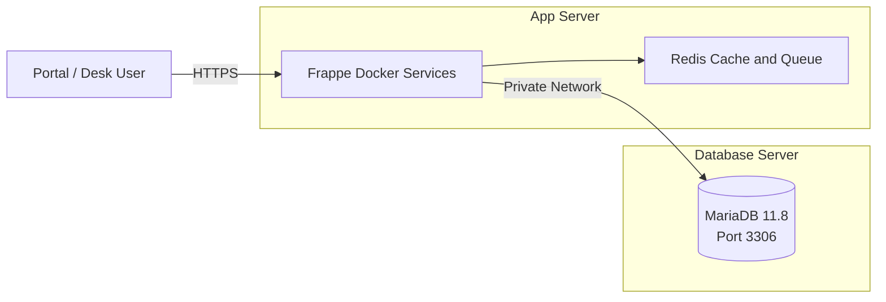

# Ubuntu တွင် External MariaDB ဖြင့် First Setup လုပ်နည်း

ဒီ guide က Frappe site ကို ပထမဆုံး setup လုပ်ချိန်ကတည်းက MariaDB ကို
App Server ထဲမှာမထားဘဲ သီးခြား Database Server ပေါ်မှာထားသုံးမည့်နည်းကို
တစ်ဆင့်ချင်းရှင်းပြထားပါတယ်။

ဒီ guide က **Fresh First Setup အတွက်သာ** ဖြစ်ပါတယ်။ Site ရှိပြီးသား၊ Local
MariaDB ထဲမှာ Data ရှိပြီးသား သို့မဟုတ် Database Export/Import လုပ်ပြီးသားဆိုရင်
ဒီနည်းကို မသုံးပါနဲ့။ [Existing Site Migration](external-database.md#existing-site-migration)
ကိုသုံးပါ။

## ရလာမည့် Architecture



Setup မစခင် ကိုယ့် environment က values တွေကို အောက်ပါ placeholders နဲ့
သတ်မှတ်ထားပါ:

| သတ်မှတ်ချက် | အသုံးပြုမည့် Placeholder |
|---|---|
| App Server IP | `<APP_PRIVATE_IP>` |
| Database Server IP | `<DB_PRIVATE_IP>` |
| MariaDB Port | `3306` |
| Frappe Site | `<SITE_NAME>` |
| Site Database | `<SITE_DB_NAME>` |

Command တွေထဲက `<...>` placeholder တွေကို ကိုယ့် server value နဲ့ အစားထိုးပါ။
Password ကို Git, documentation, screenshot သို့မဟုတ် chat ထဲ မထည့်ပါနဲ့။

## Setup အလုပ်လုပ်ပုံ

First setup မှာ `.env` က configuration အားလုံးကို စတင်ထိန်းချုပ်ပါတယ်:

```text
.env
  -> setup.sh
  -> bench new-site
  -> External MariaDB မှာ <SITE_DB_NAME> Database ဆောက်မယ်
  -> <SITE_DB_NAME> Runtime User ဆောက်မယ်
  -> sites/<SITE_NAME>/site_config.json ကို အလိုအလျောက်ရေးမယ်
```

`site_config.json` ကို ကိုယ်တိုင်ပြင်စရာ မလိုပါ။ ဒါပေမယ့် ဒီ behavior က
`<SITE_NAME>` Site မရှိသေးတဲ့ First Setup မှာပဲ မှန်ပါတယ်။

## Step 1: Database Server ကိုပြင်ဆင်ပါ

ဒီ Step က MariaDB install နဲ့ Network Troubleshooting အတွက်လိုအပ်သည့် System
Packages တွေကို အရင်ပြင်ဆင်ပေးတာဖြစ်ပါတယ်။

Database Server ကို SSH ဝင်ပါ:

```bash
ssh <DB_SERVER_USER>@<DB_PRIVATE_IP>
```

Package list update လုပ်ပြီး လိုအပ်တဲ့ tools တွေ install လုပ်ပါ:

```bash
sudo apt update
sudo apt upgrade -y
sudo apt install -y ca-certificates curl ufw netcat-openbsd
```

Server ကို reboot လိုတယ်လို့ပြရင် reboot လုပ်ပြီးမှ နောက်တစ်ဆင့်ဆက်ပါ။

## Step 2: MariaDB 11.8 Install လုပ်ပါ

Frappe က support လုပ်သည့် Database Version ကိုသုံးမှ Migration နဲ့ Runtime
Query တွေမှာ Version Compatibility ပြဿနာမဖြစ်မှာဖြစ်ပါတယ်။

Frappe `version-16` အတွက် ဒီ project က MariaDB `11.8` ကိုသုံးပါတယ်။
Deployment မလုပ်ခင် အသုံးပြုမယ့် Frappe branch ရဲ့
[official requirements](https://docs.frappe.io/framework/user/en/installation)
ကို ပြန်စစ်ပါ။

MariaDB repository setup script ကိုယူပါ:

```bash
curl -LsS https://r.mariadb.com/downloads/mariadb_repo_setup \
  -o /tmp/mariadb_repo_setup

sudo bash /tmp/mariadb_repo_setup \
  --mariadb-server-version=mariadb-11.8
```

Install မလုပ်ခင် candidate version စစ်ပါ:

```bash
apt-cache policy mariadb-server
```

Candidate က `11.8` ဖြစ်မှ ဆက်လုပ်ပါ:

```bash
sudo apt update
sudo apt install -y mariadb-server mariadb-client
sudo systemctl enable --now mariadb
```

Service နဲ့ version စစ်ပါ:

```bash
mariadb --version
sudo systemctl status mariadb --no-pager -l
sudo mariadb-admin ping
```

အောက်ပါ result ရရပါမယ်:

```text
mysqld is alive
```

MariaDB `11.8` install လုပ်ပြီး service running ဖြစ်ပြီးသားဆိုရင် ဒီ Step ကို
ထပ်လုပ်စရာမလိုပါ။

## Step 3: MariaDB ကို Private IP မှာ Listen လုပ်ခိုင်းပါ

Default Localhost binding ကိုသာသုံးထားရင် App Server က MariaDB ကိုချိတ်လို့
မရပါ။ Private IP မှာပဲ Listen လုပ်စေတာက App Server ကိုချိတ်ခွင့်ပေးပြီး Public
Network exposure ကိုရှောင်နိုင်စေပါတယ်။

Database Server မှာ config file အသစ်ဖွင့်ပါ:

```bash
sudo nano /etc/mysql/mariadb.conf.d/60-frappe.cnf
```

အောက်ပါ configuration ထည့်ပါ:

```ini
[mariadb]
bind-address = <DB_PRIVATE_IP>
port = 3306

character-set-server = utf8mb4
collation-server = utf8mb4_unicode_ci
skip-character-set-client-handshake

innodb-file-per-table = 1
max-allowed-packet = 256M
```

MariaDB restart လုပ်ပါ:

```bash
sudo systemctl restart mariadb
sudo systemctl status mariadb --no-pager -l
sudo ss -lntp | grep ':3306'
```

အောက်ပါပုံစံရရပါမယ်:

```text
LISTEN ... <DB_PRIVATE_IP>:3306 ... mariadbd
```

`127.0.0.1:3306` ပဲပြနေရင် App Server က ချိတ်လို့မရသေးပါ။

## Step 4: MariaDB ကို Secure လုပ်ပါ

Anonymous User, Test Database နဲ့ Remote Root Login ကိုဖယ်ရှားပြီး Default
Attack Surface ကိုလျှော့ချရန် ဒီ Step ကိုလုပ်ပါတယ်။

```bash
sudo mariadb-secure-installation
```

အကြံပြုထားသည့်အဖြေများ:

```text
Remove anonymous users: Y
Disallow root login remotely: Y
Remove test database: Y
Reload privilege tables: Y
```

Remote `root` login ဖွင့်စရာမလိုပါ။ နောက်အဆင့်မှာ App Server IP တစ်ခုတည်းက
အသုံးပြုနိုင်မယ့် temporary provisioning user ဆောက်ပါမယ်။

## Step 5: UFW Firewall ဖွင့်ပါ

MariaDB က Private IP မှာ Listen လုပ်ထားသော်လည်း Firewall ဖြင့် App Server IP
တစ်ခုတည်းကို ထပ်မံကန့်သတ်ထားရပါမယ်။

Database Server ရဲ့ current SSH connection ကို မပိတ်သေးဘဲ SSH rule မှန်တာ
အရင်သေချာစစ်ပါ။

App Server `<APP_PRIVATE_IP>` က Database Server `<DB_PRIVATE_IP>` port `3306`
ကိုပဲ ဝင်ခွင့်ပေးပါ:

```bash
sudo ufw allow from <APP_PRIVATE_IP> \
  to <DB_PRIVATE_IP> port 3306 proto tcp
```

SSH ကို approved administrator IP ကဝင်ခွင့်ပေးပါ:

```bash
sudo ufw allow from <ADMIN_PRIVATE_IP> \
  to <DB_PRIVATE_IP> port 22 proto tcp
```

Firewall enable လုပ်ပြီးစစ်ပါ:

```bash
sudo ufw default deny incoming
sudo ufw default allow outgoing
sudo ufw enable
sudo ufw reload
sudo ufw status numbered
```

Database rule က ဒီလိုဖြစ်ရပါမယ်:

```text
<DB_PRIVATE_IP> 3306/tcp  ALLOW IN  <APP_PRIVATE_IP>
```

Proxmox firewall, VLAN ACL သို့မဟုတ် Cloud firewall ရှိရင် အဲဒီနေရာမှာလည်း
App Server `<APP_PRIVATE_IP>/32` က DB port `3306` ကိုပဲ allow လုပ်ပါ။
`0.0.0.0/0` ကို မဖွင့်ပါနဲ့။

## Step 6: App Server ကနေ Network Test လုပ်ပါ

MariaDB User နဲ့ `.env` မပြင်မီ Routing နဲ့ Firewall အဆင်ပြေကြောင်း ခွဲခြား
စစ်နိုင်ရန် TCP Network Test ကိုအရင်လုပ်ပါတယ်။

App Server မှာ run ပါ:

```bash
ip route get <DB_PRIVATE_IP>
nc -vz -w 5 <DB_PRIVATE_IP> 3306
```

အောက်ပါ result ရရပါမယ်:

```text
Connection to <DB_PRIVATE_IP> 3306 port [tcp/mysql] succeeded!
```

Result အဓိပ္ပာယ်:

| Result | အဓိပ္ပာယ် |
|---|---|
| `succeeded` | Network နဲ့ Firewall အဆင်ပြေပြီ |
| `Connection refused` | MariaDB service သို့မဟုတ် bind address မှားနေတယ် |
| `timed out` | UFW, VLAN သို့မဟုတ် upstream firewall ပိတ်နေတယ် |
| `No route to host` | Server route/gateway မရှိသေးဘူး |

Port test အောင်မှ နောက်တစ်ဆင့်ဆက်ပါ။

## Step 7: Temporary Provisioning User ဆောက်ပါ

`setup.sh` က `<SITE_DB_NAME>` Database နဲ့ Runtime User ဆောက်နိုင်ဖို့ Temporary
privileged account တစ်ခုလိုပါတယ်။ ဒီ account က MySQL Workbench user မဟုတ်ပါ။

Database Server မှာ MariaDB ဝင်ပါ:

```bash
sudo mariadb
```

App Server IP ကိုပဲ ခွင့်ပြုပြီး user ဆောက်ပါ:

```sql
CREATE USER 'frappe_provisioner'@'<APP_PRIVATE_IP>'
  IDENTIFIED BY '<STRONG_PROVISIONER_PASSWORD>';

GRANT ALL PRIVILEGES ON *.*
  TO 'frappe_provisioner'@'<APP_PRIVATE_IP>'
  WITH GRANT OPTION;

FLUSH PRIVILEGES;

SHOW GRANTS FOR 'frappe_provisioner'@'<APP_PRIVATE_IP>';
EXIT;
```

`<STRONG_PROVISIONER_PASSWORD>` နေရာမှာ random strong password သုံးပါ။
`admin` မသုံးပါနဲ့။ ဒီ user ကို setup ပြီးရင် Step 13 မှာဖျက်ပါမယ်။

## Step 8: Provisioning Login Test လုပ်ပါ

Network Test အောင်ရုံနဲ့ MariaDB Authentication အောင်တယ်လို့ မဆိုနိုင်ပါ။
Setup မစခင် Provisioning User ရဲ့ Password, Host restriction နဲ့ Privileges
မှန်ကြောင်း ဒီ Step က သီးခြားစစ်ပေးပါတယ်။

App Server မှာ MariaDB client install လုပ်ပါ:

```bash
sudo apt update
sudo apt install -y mariadb-client
```

Provisioning account နဲ့ login စမ်းပါ:

```bash
mariadb --protocol=TCP \
  --host=<DB_PRIVATE_IP> \
  --port=3306 \
  --user=frappe_provisioner \
  --password \
  --execute="SELECT VERSION(), USER(), CURRENT_USER();"
```

Password prompt မှာ `<STRONG_PROVISIONER_PASSWORD>` ကိုထည့်ပါ။ Command ထဲမှာ
password ကို တိုက်ရိုက်မရေးပါနဲ့။

`CURRENT_USER()` က အောက်ပါအတိုင်းပြရပါမယ်:

```text
frappe_provisioner@<APP_PRIVATE_IP>
```

`Access denied` ဖြစ်ရင် `.env` မပြင်သေးဘဲ MariaDB user, Host နဲ့ password ကို
အရင်ပြန်စစ်ပါ။

## Step 9: Site အဟောင်းမရှိကြောင်း သေချာပါစေ

ဒီအဆင့်က အရေးကြီးပါတယ်။ `setup.sh` က `<SITE_NAME>` Site ရှိပြီးသားဆိုရင်
`bench new-site` မလုပ်ပါဘူး။ အဲဒီအခါ `.env` ထဲက `DB_NAME` နဲ့ `DB_PASSWORD`
ကို ignore လုပ်ပါတယ်။

App Server မှာစစ်ပါ:

```bash
cd ~/my-frappe-setup/docker-setup

docker compose -f pwd-with-apps.yml -f docker-compose.override.yml \
  exec backend bench list-sites
```

- `<SITE_NAME>` မရှိရင် First Setup ကို ဆက်လုပ်နိုင်ပါတယ်။
- `<SITE_NAME>` ရှိရင် ဒီ guide ကို ရပ်ပါ။ Site သို့မဟုတ် Docker Volume ကို မဖျက်ပါနဲ့။
  Existing-site migration procedure ကိုသုံးပါ။
- Containers မရှိသေးလို့ command မ run နိုင်တာက fresh server မှာ ပုံမှန်ဖြစ်ပါတယ်။

Database Server မှာ `<SITE_DB_NAME>` ရှိပြီးသားလားလည်းစစ်ပါ:

```bash
sudo mariadb --execute="SHOW DATABASES LIKE '<SITE_DB_NAME>';"
```

Fresh Setup အတွက် `<SITE_DB_NAME>` Database ကို ကြိုဆောက်စရာမလိုပါ။ `setup.sh` က
ဆောက်ပေးမှာပါ။ Database ရှိပြီးသား သို့မဟုတ် Imported Data ရှိရင် မဖျက်ပါနဲ့။
Existing-site migration ကိုသုံးပါ သို့မဟုတ် first setup အတွက် မသုံးရသေးတဲ့
database name အသစ်ရွေးပါ။

## Step 10: App Server `.env` ပြင်ပါ

`.env` က Setup Script နဲ့ Docker Compose အတွက် Source of Truth ဖြစ်ပါတယ်။
Target Database Host, Provisioning Credentials နဲ့ Fresh Site Runtime
Credentials ကို ဒီနေရာမှာ တစ်ကြိမ်တည်းသတ်မှတ်ပေးရပါတယ်။

App Server မှာ file ကိုဖွင့်ပါ:

```bash
cd ~/my-frappe-setup/docker-setup
cp .env .env.before-external-db
nano .env
```

`SITE_DOMAIN` နဲ့ Database section ကို အောက်ပါအတိုင်းထားပါ:

```env
SITE_DOMAIN=<SITE_NAME>

# External Database Server ကိုသုံးမယ်။
DATABASE_MODE=external
DB_HOST=<DB_PRIVATE_IP>
DB_PORT=3306

# Local Compose DB အတွက် values ဖြစ်တယ်။ External login အတွက် မသုံးဘူး။
# Strong values ထားပြီး Git ထဲ မတင်ပါနဲ့။
MYSQL_ROOT_PASSWORD=<STRONG_LOCAL_DB_ROOT_PASSWORD>
MARIADB_ROOT_PASSWORD=<STRONG_LOCAL_DB_ROOT_PASSWORD>

# Step 7 မှာဆောက်ခဲ့တဲ့ temporary external provisioning account။
DB_ROOT_USERNAME=frappe_provisioner
DB_ROOT_PASSWORD=<STRONG_PROVISIONER_PASSWORD>

# External DB ကို automatic credential repair မလုပ်ခိုင်းရန်။
ALLOW_EXTERNAL_DB_CREDENTIAL_REPAIR=false

# First setup မှာ ဆောက်မယ့် site database နဲ့ runtime-user password။
DB_NAME=<SITE_DB_NAME>
DB_PASSWORD=<STRONG_SITE_DATABASE_PASSWORD>
```

### Variable တစ်ခုချင်းအဓိပ္ပာယ်

| Variable | First setup မှာဘာလုပ်သလဲ |
|---|---|
| `DATABASE_MODE=external` | Bundled `db` service အစား သီးခြား MariaDB ကိုသုံးစေတယ် |
| `DB_HOST` | Database Server ရဲ့ private IP ဖြစ်တယ် |
| `DB_PORT` | MariaDB port ဖြစ်တယ် |
| `DB_ROOT_USERNAME` | Database/user ဆောက်ခွင့်ရှိတဲ့ temporary provisioner ဖြစ်တယ် |
| `DB_ROOT_PASSWORD` | Provisioner password ဖြစ်တယ် |
| `DB_NAME=<SITE_DB_NAME>` | `bench new-site` က သတ်မှတ်ထားသည့် Site Database ဆောက်စေတယ် |
| `DB_PASSWORD` | Frappe runtime database user ရဲ့ password ဖြစ်လာမယ် |
| `ALLOW_EXTERNAL_DB_CREDENTIAL_REPAIR=false` | External DB credential ကို setup က အလိုအလျောက်ပြင်ခြင်းပိတ်ထားတယ် |
| `MYSQL_ROOT_PASSWORD` | Local Compose DB အတွက်သာဖြစ်ပြီး external MariaDB password မဟုတ်ဘူး |
| `MARIADB_ROOT_PASSWORD` | Local Compose DB compatibility value ဖြစ်တယ် |

Password နှစ်မျိုးကို မရောပါနဲ့:

```text
DB_ROOT_PASSWORD = setup အချိန် database/user ဆောက်ပေးမယ့် temporary password
DB_PASSWORD      = Site အမြဲသုံးမယ့် Runtime User Password
```

ဒီ guide မှာ `DB_ROOT_USERNAME=workbench_uat` မသုံးပါ။ Workbench account က
human database access အတွက်ဖြစ်ပြီး Frappe provisioning account မဟုတ်ပါ။

`.env` ကို repository ထဲ commit မဖြစ်အောင်စစ်ပါ:

```bash
git check-ignore .env
```

`.env` လို့ output ထွက်ရပါမယ်။

## Step 11: First Setup Run ပါ

ဒီ Step မှာ `.env` က Target Database Server ကိုဆုံးဖြတ်ပြီး `setup.sh` က
Preflight, Image Build, Site Creation နဲ့ App Installation ကို စုစည်းလုပ်ပေးပါတယ်။

App Server မှာ:

```bash
cd ~/my-frappe-setup/docker-setup
./setup.sh
```

Confirmation မပေးခင် summary ထဲမှာ ဒီလိုပြတာသေချာပါစေ:

```text
Database: external (<DB_PRIVATE_IP>:3306)
```

`Database: local (db:3306)` လို့ပြနေရင် setup ကို cancel လုပ်ပြီး `.env`
ပြန်စစ်ပါ။

First setup အောင်မြင်တဲ့အခါ script က:

1. `<DB_PRIVATE_IP>:3306` network connection စစ်မယ်;
2. Frappe, Redis, workers နဲ့ scheduler containers စမယ်;
3. `common_site_config.json` မှာ external `db_host` ရေးမယ်;
4. `bench new-site <SITE_NAME>` run မယ်;
5. MariaDB မှာ `<SITE_DB_NAME>` Database နဲ့ Runtime User ဆောက်မယ်;
6. `site_config.json` မှာ database login ကို အလိုအလျောက်ရေးမယ်;
7. configured apps တွေ install လုပ်ပြီး migrate လုပ်မယ်။

## Step 12: Setup Result Verify လုပ်ပါ

Setup command အောင်မြင်တယ်ဆိုတဲ့ Exit Status တစ်ခုတည်းကိုမယုံဘဲ Shared Config,
Site Config, Database Authentication နဲ့ Application Write ကို သီးခြားစစ်ပါ။

### 12.1 Containers စစ်ပါ

```bash
docker compose -f pwd-with-apps.yml -f docker-compose.override.yml ps
```

### 12.2 Shared Database Host စစ်ပါ

```bash
docker compose -f pwd-with-apps.yml -f docker-compose.override.yml \
  exec backend cat sites/common_site_config.json
```

အနည်းဆုံး ဒီ values ပါရပါမယ်:

```json
{
  "db_host": "<DB_PRIVATE_IP>",
  "db_port": 3306
}
```

### 12.3 Site Database Config စစ်ပါ

Password ကို ဖျောက်ပြီးကြည့်ပါ:

```bash
docker compose -f pwd-with-apps.yml -f docker-compose.override.yml \
  exec backend jq \
  '{db_name, db_user, db_password:
    (if .db_password then "<redacted>" else null end)}' \
  sites/<SITE_NAME>/site_config.json
```

မျှော်မှန်းရမည့် Result:

```json
{
  "db_name": "<SITE_DB_NAME>",
  "db_user": "<SITE_DB_NAME>",
  "db_password": "<redacted>"
}
```

### 12.4 Frappe Database Query စစ်ပါ

```bash
docker compose -f pwd-with-apps.yml -f docker-compose.override.yml \
  exec backend bench --site <SITE_NAME> list-apps
```

Installed apps list ထွက်လာရင် Frappe က external database နဲ့ authenticate
လုပ်နိုင်ပါပြီ။

### 12.5 Application စမ်းပါ

1. Browser ကနေ login ဝင်ပါ။
2. Test record တစ်ခု create/save/read လုပ်ပါ။
3. Background job နဲ့ scheduler အလုပ်လုပ်တာစစ်ပါ။
4. `./backup.sh` run ပြီး non-empty database backup ထွက်တာစစ်ပါ။

## Step 13: Temporary Provisioner ကိုဖျက်ပါ

Provisioning User မှာ Database နဲ့ User အသစ်ဆောက်နိုင်သည့် High Privileges
ရှိပါတယ်။ First Setup ပြီးနောက် Frappe က Limited Runtime User ကိုသာသုံးတာကြောင့်
Attack Surface လျှော့ချရန် Temporary Provisioner ကိုပြန်ဖျက်ရပါတယ်။

Step 12 အားလုံးအောင်မှ Database Server မှာဖျက်ပါ:

```bash
sudo mariadb
```

```sql
DROP USER 'frappe_provisioner'@'<APP_PRIVATE_IP>';
FLUSH PRIVILEGES;
EXIT;
```

App Server `.env` မှာ temporary credentials ကိုရှင်းပါ:

```env
DB_ROOT_USERNAME=
DB_ROOT_PASSWORD=
ALLOW_EXTERNAL_DB_CREDENTIAL_REPAIR=false
```

အောက်ပါ runtime connection values ကို မပြောင်းပါနဲ့:

```env
DATABASE_MODE=external
DB_HOST=<DB_PRIVATE_IP>
DB_PORT=3306
```

`DB_NAME` နဲ့ `DB_PASSWORD` က site ဖန်တီးပြီးနောက် existing site ကို
ပြန်configure မလုပ်ပေးတော့ပါ။ Site က `site_config.json` ထဲမှာ setup ရေးပေးထားတဲ့
runtime credentials ကိုဆက်သုံးပါတယ်။

## Step 14: Optional Runtime User Hardening

Runtime User ကို App Server Private IP ကနေပဲ Login ဝင်နိုင်အောင် Host
restriction တင်းကျပ်ခြင်းဖြစ်ပါတယ်။ Multiple App Servers ထည့်မည့် Architecture
ကိုထည့်စဉ်းစားပြီးမှ Wildcard Account ကိုဖျက်ပါ။

`bench new-site` ဖန်တီးထားတဲ့ runtime account ရဲ့ Host ကိုစစ်ပါ:

```bash
sudo mariadb --execute="
SELECT User, Host
FROM mysql.user
WHERE User = '<SITE_DB_NAME>';
"
```

Runtime user ကို `%` Host နဲ့ဖန်တီးထားရင် maintenance window အတွင်း
`<APP_PRIVATE_IP>` App Server IP ကိုပဲခွင့်ပြုဖို့ harden လုပ်နိုင်ပါတယ်။ Exact-host
account အသစ်နဲ့ login အောင်တာကိုအရင်စစ်ပြီးမှ wildcard account ကိုဖျက်ပါ။
Multiple App Servers သုံးမယ်ဆို App Server တစ်လုံးချင်းစီအတွက် exact Host account
နဲ့ firewall rule လိုပါတယ်။

## အဖြစ်များသည့် Errors

### `nc` command timed out

Database Server မှာ:

```bash
sudo ss -lntp | grep ':3306'
sudo ufw status numbered
sudo tcpdump -ni any 'tcp port 3306'
```

App Server က `nc` ပြန် run လုပ်ပြီး packet Database Server ထိရောက်လားစစ်ပါ။

### `Access denied for user 'frappe_provisioner'`

Database Server မှာ:

```sql
SELECT User, Host
FROM mysql.user
WHERE User = 'frappe_provisioner';

SHOW GRANTS FOR 'frappe_provisioner'@'<APP_PRIVATE_IP>';
```

App Server ရဲ့ routed source IP, MariaDB Host value နဲ့ password တူရပါမယ်။

### `Database <SITE_DB_NAME> already exists`

ဒီ deployment က fresh setup မဟုတ်နိုင်ပါ။ Database ကိုမဖျက်ပါနဲ့။ Existing data
ရှိမရှိစစ်ပြီး migration procedure ကိုသုံးပါ သို့မဟုတ် unused database name
အသစ်ရွေးပါ။

### `Site <SITE_NAME> already exists`

`setup.sh` က `DB_NAME`/`DB_PASSWORD` ကိုမသုံးတော့ဘဲ existing
`site_config.json` ကိုသုံးမှာပါ။ Site ကိုမဖျက်ပါနဲ့။ Existing-site migration
procedure ကိုသုံးပါ။

### `common_site_config.json` မှာ `"db_host": "db"` ဖြစ်နေတယ်

`.env` ကို run နေတဲ့ `docker-setup` directory မှာပဲပြင်ထားလား စစ်ပါ:

```bash
cd ~/my-frappe-setup/docker-setup
grep -E '^(DATABASE_MODE|DB_HOST|DB_PORT)=' .env
```

မျှော်မှန်းရမည့် Result:

```text
DATABASE_MODE=external
DB_HOST=<DB_PRIVATE_IP>
DB_PORT=3306
```

Site မရှိသေးသော Fresh Setup ဆို `./setup.sh` ကို run ပါ။ Site ရှိပြီးသား
Reconfiguration ဆို `./setup.sh --reconfigure` ကို run ပါ။ Configurator က
`common_site_config.json` ကို update လုပ်ပေးပါမယ်။ Existing Data ရှိပါက
Setup မလုပ်မီ [Existing Site Migration](external-database.md#existing-site-migration)
procedure ကိုလိုက်နာပါ။

## နောက်ဆုံးစစ်ဆေးရန် Checklist

- [ ] ဒီ Deployment မှာ `<SITE_NAME>` Site နဲ့ Imported Database မရှိသေးပါ။
- [ ] MariaDB `11.8` running ဖြစ်ပါတယ်။
- [ ] MariaDB က `<DB_PRIVATE_IP>:3306` မှာ listen လုပ်ပါတယ်။
- [ ] UFW က `<APP_PRIVATE_IP>` App Server ကိုပဲ `3306` ခွင့်ပြုပါတယ်။
- [ ] App Server က `nc` test အောင်ပါတယ်။
- [ ] `frappe_provisioner` authentication test အောင်ပါတယ်။
- [ ] `.env` မှာ `DATABASE_MODE=external` ဖြစ်ပါတယ်။
- [ ] `.env` မှာ First Setup အတွက် `DB_NAME=<SITE_DB_NAME>` သတ်မှတ်ထားပါတယ်။
- [ ] Setup summary မှာ external Database IP မှန်ပါတယ်။
- [ ] `common_site_config.json` မှာ external `db_host` ဖြစ်ပါတယ်။
- [ ] `site_config.json` မှာ Site Runtime Credentials အလိုအလျောက်ရှိပါတယ်။
- [ ] `bench --site <SITE_NAME> list-apps` အောင်ပါတယ်။
- [ ] Login, record write, workers, scheduler နဲ့ backup စစ်ပြီးပါပြီ။
- [ ] Temporary `frappe_provisioner` account ကိုဖျက်ပြီးပါပြီ။
