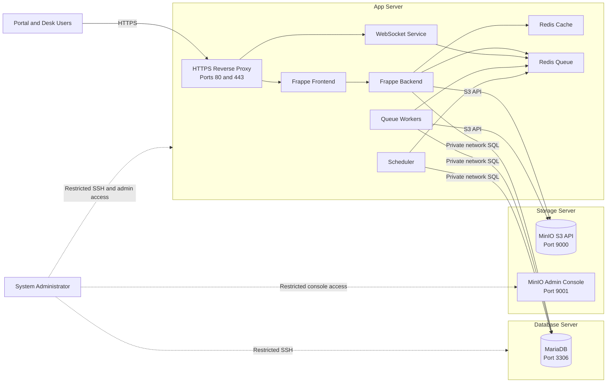
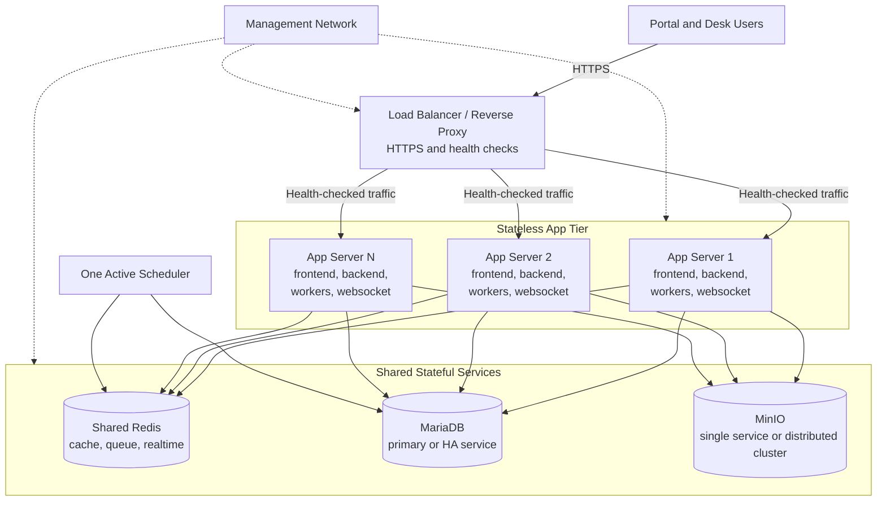

# Three-Server Deployment Architecture and Scaling Guide

This document describes the deployment architecture for a Frappe application
using three separate servers:

1. **App Server** — runs the Frappe web application and background services;
2. **Database Server** — runs MariaDB and stores transactional data; and
3. **Storage Server** — runs MinIO and stores S3-backed files and backups.

It also defines the target architecture and operational requirements for
scaling from one App Server to multiple App Servers later.

Use private network addresses between servers. Do not commit real addresses,
credentials, customer names, or environment-specific secrets to this document.

## 1. Architecture Goals

The three-server design provides:

- separation of application, database, and file-storage workloads;
- independent resource sizing and maintenance;
- a smaller network exposure surface for MariaDB and MinIO;
- a clear path for adding App Servers behind a Load Balancer;
- independent backup and recovery responsibilities.

Separation alone does not provide High Availability. In the current design,
each server remains a Single Point of Failure until redundancy is added for its
service.

## 2. Current Three-Server Architecture



### 2.1 Server responsibilities

| Server | Main services | Persistent state | Must not be publicly exposed |
|---|---|---|---|
| App Server | Reverse Proxy, Frappe frontend/backend, WebSocket, workers, scheduler, Redis | Site configuration, logs, and any files not migrated to S3 | Redis and internal container ports |
| Database Server | MariaDB | Frappe databases, MariaDB users, grants, and database backups | MariaDB port `3306` |
| Storage Server | MinIO S3 API and console | Attachments, PDFs, objects, and optional backup objects | S3 API and admin console unless explicitly protected |

### 2.2 Application containers

The App Server uses the Docker Compose services defined by this repository:

| Service | Responsibility |
|---|---|
| `frontend` | Serves the site and forwards application requests |
| `backend` | Runs Frappe/Python request handling and Bench commands |
| `websocket` | Handles realtime browser connections |
| `queue-short` | Processes short background jobs |
| `queue-long` | Processes long background jobs |
| `scheduler` | Enqueues scheduled Frappe jobs |
| `redis-cache` | Stores cache data |
| `redis-queue` | Supports queues and realtime event transport |
| `configurator` | Writes shared Frappe connection configuration during setup |

In external database mode, the bundled Compose `db` service is not the active
database. The App Server uses the private MariaDB address configured in `.env`.

## 3. Configuration Ownership

Keep configuration ownership explicit so that changing one server does not
silently redirect another service.

| Setting | Canonical location | Example purpose |
|---|---|---|
| Database mode and address | `docker-setup/.env` | `DATABASE_MODE`, `DB_HOST`, `DB_PORT` |
| Site database identity | `sites/<SITE_DOMAIN>/site_config.json` | `db_name`, `db_user`, `db_password` |
| MinIO endpoint and access configuration | `docker-setup/.env` and Frappe S3 settings | S3 API endpoint, bucket, access key, secret |
| Redis endpoints | `sites/common_site_config.json` | Cache, queue, and WebSocket Redis services |
| Public site URL | `.env` and site configuration | Reverse Proxy hostname and HTTPS URL |
| Encryption key | `sites/<SITE_DOMAIN>/site_config.json` | Decrypts credentials stored by Frappe |

All App Servers serving the same site must have the same site configuration,
including the same `encryption_key`. Never generate a different encryption key
on a newly added App Server.

Detailed setup procedures:

- [External MariaDB on Ubuntu](external-database-ubuntu.md)
- [MinIO S3 integration](minio-s3-integration-guide.md)
- [Reverse Proxy configuration](reverse-proxy-guide.md)
- [Backup procedure](backup.md)
- [Restore procedure](restore.md)

## 4. Request and Data Flow

### 4.1 Normal web request

```text
Browser
  -> HTTPS Reverse Proxy
  -> Frappe frontend
  -> Frappe backend
  -> MariaDB for transactional data
  -> MinIO when an S3-backed file is read or written
  -> Browser response
```

### 4.2 Background job

```text
Frappe backend or scheduler
  -> Redis queue
  -> queue-short or queue-long worker
  -> MariaDB and/or MinIO
```

### 4.3 Realtime event

```text
Frappe backend
  -> Redis queue/realtime channel
  -> WebSocket service
  -> Connected browser
```

### 4.4 File upload

```text
Browser
  -> App Server
  -> Frappe file validation and permission checks
  -> MinIO S3 API
  -> File metadata stored in MariaDB
```

Private files must still pass application authorization. Storing a file in
MinIO does not replace Frappe permission checks.

## 5. Network and Firewall Model

Recommended allowlist:

| Source | Destination | Port | Purpose |
|---|---|---:|---|
| Users or trusted Reverse Proxy | App Server | `443/tcp` | HTTPS application access |
| App Server | Database Server | `3306/tcp` | MariaDB connection |
| App Server | Storage Server | `9000/tcp` | MinIO S3 API |
| Approved administrators | Each server | `22/tcp` | SSH administration |
| Approved administrators or management network | Storage Server | `9001/tcp` | MinIO console |

Security requirements:

- expose only HTTPS to application users;
- restrict MariaDB `3306` to the routed source IP of each App Server;
- restrict MinIO S3 and console access to approved sources;
- do not publish Redis ports outside the Docker/private service network;
- use TLS for external and untrusted network paths;
- keep administrative access on a management network or VPN;
- use separate least-privilege credentials for Frappe, backup jobs, and human
  administration.

## 6. Current Availability Characteristics

The current three-server deployment improves isolation but has the following
failure behavior:

| Failure | Effect |
|---|---|
| App Server unavailable | Portal, Desk, workers, scheduler, and realtime access stop |
| Database Server unavailable | Requests and jobs requiring database access fail |
| Storage Server unavailable | S3-backed uploads and file access fail; database-only operations may continue |
| App Server Redis unavailable | Cache, queues, scheduled work, and realtime features are affected |

Backups stored only on the same Database or Storage Server are not sufficient
for disaster recovery. Keep verified copies in a separate failure domain and
perform periodic restore tests.

## 7. Target Multiple-App-Server Architecture

The target design adds a Load Balancer and runs identical Frappe application
nodes against shared stateful services.



## 8. Requirements Before Adding App Servers

Do not place a second independent copy of the current App Server behind a Load
Balancer without addressing the shared-state requirements below.

### 8.1 Identical application release

Every App Server must run:

- the same Frappe and application versions;
- the same immutable/custom Docker image;
- the same built frontend assets;
- the same migration level;
- the same site and global configuration.

Use a rolling deployment only when the old and new application versions are
schema-compatible during the rollout. Run database migrations once as a
controlled deployment step.

### 8.2 Shared site configuration and secrets

Every node must use the same:

- `SITE_DOMAIN`;
- database name, username, and password;
- `encryption_key`;
- MinIO endpoint, bucket, and credentials;
- Redis endpoints;
- application integration secrets.

Distribute secrets through an approved secret-management process. Do not copy
them into Git or bake them into a public image.

### 8.3 Shared Redis

The current single-App-Server Compose stack runs Redis locally. For reliable
multi-App operation, configure all App Servers, workers, schedulers, and
WebSocket services to use the same approved Redis cache and queue/realtime
services.

Independent Redis instances can cause:

- jobs to be visible only to workers on one node;
- cache inconsistency;
- realtime events not reaching users connected to another node;
- operational confusion during failover.

Select and test the Redis availability model before production scaling. Do not
assume that adding containers automatically provides Redis High Availability.

### 8.4 One active scheduler

Run one active Frappe scheduler for the site unless the deployed Frappe version
and scheduler design explicitly support coordinated multi-scheduler operation.
Starting an independent scheduler on every App Server can enqueue duplicate
scheduled work.

Workers may be scaled separately from web nodes, provided all workers use the
shared Redis queues, shared MariaDB database, identical application code, and
the same site configuration.

### 8.5 Shared file storage

All App Servers must read and write the same durable file store. MinIO provides
the shared object boundary for S3-backed files.

Before adding nodes, confirm that no required uploads remain only in an App
Server's local `sites/<SITE_DOMAIN>/public/files` or `private/files` directory.
If local files remain, migrate them or provide a supported shared filesystem.

The current S3 attachment integration has a documented bucket-model
limitation. Review the
[MinIO S3 integration guide](minio-s3-integration-guide.md#bucket-model-limitation)
before treating public and private files as independently isolated buckets.

### 8.6 Load Balancer behavior

The Load Balancer must provide:

- TLS termination or TLS pass-through according to the security design;
- HTTP health checks that remove unhealthy App Servers;
- WebSocket upgrade support;
- forwarded client/protocol headers trusted only from approved proxies;
- request/body-size and timeout values suitable for application uploads;
- connection draining during deployments.

Session affinity may be used during the first scaling phase, but it is not a
substitute for shared Redis, shared file storage, and identical configuration.

### 8.7 Database capacity and connection limits

Each additional backend and worker increases MariaDB connections. Before
scaling:

- measure current concurrent connections and query latency;
- calculate the maximum connection demand from all web and worker processes;
- verify MariaDB `max_connections`, CPU, memory, storage latency, and IOPS;
- retain per-database least-privilege grants for every App Server source IP;
- monitor slow queries, locks, replication health if applicable, and disk
  growth.

Do not solve connection pressure by raising limits without confirming memory
capacity and application query behavior.

## 9. Recommended Scaling Stages

### Stage 1 — current separated deployment

- one App Server;
- one MariaDB Server;
- one MinIO Server;
- Redis and Scheduler on the App Server;
- verified backups and monitoring.

### Stage 2 — prepare shared application state

- move Redis to shared/private infrastructure;
- verify all required files are in shared MinIO or another supported shared
  store;
- centralize configuration and secrets distribution;
- create a repeatable immutable App Server deployment;
- add health checks and centralized logs/metrics.

### Stage 3 — add the Load Balancer and second App Server

- deploy an identical second App Server;
- allow its private IP through MariaDB and MinIO firewalls;
- connect both nodes to the same Redis, MariaDB, and MinIO services;
- keep only one active Scheduler;
- validate HTTP, background jobs, realtime events, uploads, and permissions;
- send test traffic through the Load Balancer before production cutover.

### Stage 4 — scale by measured demand

- add web nodes for request concurrency;
- add workers independently for queue throughput;
- scale MariaDB, Redis, and MinIO based on measured bottlenecks;
- introduce service redundancy and tested failover where availability targets
  require it.

## 10. Deployment and Migration Sequence

For each App Server release:

1. build and identify one immutable application image/version;
2. take and verify a database backup before schema migrations;
3. enable maintenance mode if the migration requires exclusive access;
4. run migrations once from a designated deployment node;
5. deploy/recreate App Servers in controlled batches;
6. wait for each health check before sending traffic;
7. verify workers, scheduler, WebSocket, database, and MinIO access;
8. remove maintenance mode and monitor errors, latency, and queues;
9. retain a rollback artifact and follow a data-safe rollback plan.

Do not run incompatible migrations concurrently from multiple App Servers.

## 11. Monitoring and Alerts

Monitor at least:

| Layer | Signals |
|---|---|
| Load Balancer | Healthy backends, request rate, 4xx/5xx, latency, TLS expiry |
| App Servers | CPU, memory, disk, container restarts, application errors |
| Workers | Queue depth, oldest job age, failed jobs, worker availability |
| Scheduler | Last successful tick and scheduled-job failures |
| Redis | Memory, evictions, connectivity, persistence/replication state if used |
| MariaDB | Connections, slow queries, locks, buffer pool, replication, disk space |
| MinIO | Capacity, object errors, node/disk health, replication and backup status |
| Backups | Last success, size anomaly, off-server copy, restore-test age |

Alerts must identify the affected layer. A generic site-down alert is not
enough to distinguish an App Server failure from MariaDB, Redis, or MinIO
failure.

## 12. Backup and Recovery Boundaries

A complete Frappe recovery set includes:

- MariaDB database backup;
- site configuration backup, protected as a secret;
- the original `encryption_key`;
- all public/private local files not stored in S3;
- MinIO objects and bucket configuration;
- application image/version and app list;
- infrastructure configuration required to recreate the services.

Database and MinIO backups should be consistent enough for the application's
recovery-point objective. A database restored without the matching file
objects can leave broken attachments. Test the complete recovery process in an
approved non-production environment.

## 13. Architecture Acceptance Checklist

### Current three-server deployment

- [ ] Only the App Server or approved proxy accepts public HTTPS traffic.
- [ ] MariaDB accepts `3306` only from approved App Server source IPs.
- [ ] MinIO API and console access are restricted to approved sources.
- [ ] Frappe uses the external MariaDB address in `common_site_config.json`.
- [ ] Frappe uploads and reads S3-backed files through MinIO.
- [ ] Redis ports are not publicly exposed.
- [ ] Database, files, configuration, and encryption key are backed up.
- [ ] Restore tests and monitoring are operational.

### Before multiple App Servers

- [ ] A Load Balancer with health checks and WebSocket support is ready.
- [ ] All App Servers use an identical application image and migration level.
- [ ] Site configuration and `encryption_key` are identical on every node.
- [ ] Redis cache, queues, and realtime transport are shared.
- [ ] Exactly one active Scheduler is designated.
- [ ] Required files are on shared storage rather than node-local volumes.
- [ ] MariaDB and MinIO allow every approved App Server source IP.
- [ ] Connection capacity and resource limits are measured.
- [ ] Rolling deployment, failure, and rollback scenarios are tested.

