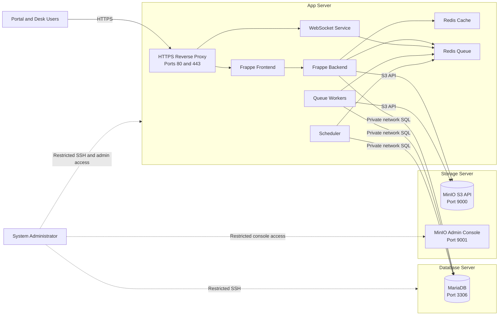
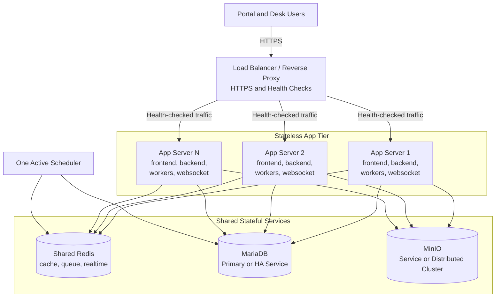

# Three-Server Deployment Architecture နှင့် Scaling လမ်းညွှန်

ဒီ Architecture တွင် Server သုံးလုံးကို သီးခြားသုံးသည်။

1. **App Server** — Frappe Web Application နှင့် Background Services
2. **Database Server** — MariaDB နှင့် Transactional Data
3. **Storage Server** — MinIO နှင့် S3-backed Files/Backups

နောက်ပိုင်း App Server တစ်လုံးမှ အများအပြားသို့ Scale လုပ်ရာတွင် လိုအပ်သော
Target Architecture နှင့် Operational requirements များကိုလည်း ဖော်ပြထားသည်။
Server အချင်းချင်း Private Network သုံးပါ။ IP အစစ်၊ Credentials၊ Customer name
နှင့် Environment-specific Secrets များကို Documentation/Git ထဲ မထည့်ပါနှင့်။

## 1. Architecture ရည်ရွယ်ချက်

- Application, Database နှင့် File-storage workloads ခွဲထားရန်။
- Server တစ်လုံးချင်း Resource sizing နှင့် Maintenance သီးခြားလုပ်ရန်။
- MariaDB နှင့် MinIO ၏ Network exposure ကို လျှော့ချရန်။
- Load Balancer နောက်တွင် App Servers ထပ်ထည့်နိုင်သော လမ်းကြောင်းထားရန်။
- Backup နှင့် Recovery တာဝန်များ ရှင်းလင်းစွာခွဲရန်။

Server ခွဲထားရုံဖြင့် High Availability မရပါ။ Redundancy မထည့်သေးသရွေ့
Server တစ်လုံးချင်းသည် Single Point of Failure ဖြစ်နေဆဲဖြစ်သည်။

## 2. လက်ရှိ Three-Server Architecture



### Server တစ်လုံးချင်း၏ တာဝန်

| Server | Main Services | Persistent State | Public မဖွင့်ရမည့်အရာ |
|---|---|---|---|
| App Server | Reverse Proxy, frontend/backend, WebSocket, workers, scheduler, Redis | Site config, Logs, S3 မရွှေ့ရသေးသော Files | Redis နှင့် Internal ports |
| Database Server | MariaDB | Frappe Databases, Users, Grants, Backups | `3306` |
| Storage Server | MinIO S3 API/Console | Attachments, PDFs, Objects, Optional Backups | `9000`, `9001` ကို Approved sources မှလွဲ၍ မဖွင့်ရ |

App Server Services—

| Service | တာဝန် |
|---|---|
| `frontend` | Site serve လုပ်ပြီး Application requests လွှဲသည်။ |
| `backend` | Frappe/Python requests နှင့် Bench commands run သည်။ |
| `websocket` | Realtime browser connections ကို ကိုင်တွယ်သည်။ |
| `queue-short`, `queue-long` | Background jobs ကို ဆောင်ရွက်သည်။ |
| `scheduler` | Scheduled Frappe jobs ကို Queue ထဲထည့်သည်။ |
| `redis-cache` | Cache data သိမ်းသည်။ |
| `redis-queue` | Queue နှင့် Realtime event transport ကို ထောက်ပံ့သည်။ |
| `configurator` | Setup အတွင်း Shared Frappe connection config ရေးသည်။ |

External Database mode တွင် Compose `db` service ကို မသုံးဘဲ `.env` ရှိ
Private MariaDB address ကို သုံးသည်။

## 3. Configuration ပိုင်ဆိုင်ရာနေရာ

| Setting | Canonical နေရာ | ရည်ရွယ်ချက် |
|---|---|---|
| Database mode/address | `docker-setup/.env` | `DATABASE_MODE`, `DB_HOST`, `DB_PORT` |
| Site Database identity | `sites/<SITE_DOMAIN>/site_config.json` | `db_name`, `db_user`, `db_password` |
| MinIO settings | `.env` နှင့် Frappe S3 settings | Endpoint, Bucket, Access Key, Secret |
| Redis endpoints | `sites/common_site_config.json` | Cache, Queue, WebSocket Redis |
| Public URL | `.env` နှင့် Site config | Reverse Proxy hostname/HTTPS URL |
| Encryption Key | `sites/<SITE_DOMAIN>/site_config.json` | Frappe သိမ်းထားသော Credentials decrypt လုပ်ရန် |

Site တစ်ခုတည်းကို Serve လုပ်သော App Servers အားလုံးတွင် Site configuration
နှင့် `encryption_key` တူရမည်။ App Server အသစ်တွင် Encryption Key အသစ်
မဖန်တီးပါနှင့်။

ဆက်စပ်လမ်းညွှန်များ—

- [External MariaDB](../database/external-database-ubuntu.md)
- [MinIO S3](../storage/minio-s3-integration-guide.md)
- [Reverse Proxy](reverse-proxy-guide.md)
- [Backup](../operations/backup.md) / [Restore](../operations/restore.md)

## 4. Request နှင့် Data Flow

```text
Web request:
Browser -> HTTPS Reverse Proxy -> frontend -> backend
        -> MariaDB / MinIO -> Browser response

Background job:
backend or scheduler -> Redis queue -> worker -> MariaDB and/or MinIO

Realtime event:
backend -> Redis realtime channel -> WebSocket -> Browser

File upload:
Browser -> App Server -> Frappe permission validation
        -> MinIO object + MariaDB File metadata
```

MinIO ထဲသိမ်းထားခြင်းသည် Frappe Permission check ကို အစားမထိုးပါ။ Private File
ဖွင့်တိုင်း Server-side Authorization ဖြတ်ရမည်။

## 5. Network နှင့် Firewall

| Source | Destination | Port | ရည်ရွယ်ချက် |
|---|---|---:|---|
| Users/Trusted Proxy | App Server | `443/tcp` | HTTPS |
| App Server | Database Server | `3306/tcp` | MariaDB |
| App Server | Storage Server | `9000/tcp` | MinIO S3 API |
| Approved Admins | Servers | `22/tcp` | SSH |
| Approved Admins/Management Network | Storage Server | `9001/tcp` | MinIO Console |

- Application User များအတွက် HTTPS ကိုသာ expose လုပ်ပါ။
- MariaDB `3306` ကို App Server တစ်လုံးချင်း၏ Routed source IP အတွက်သာ ဖွင့်ပါ။
- MinIO API/Console ကို Approved sources အတွက်သာ ဖွင့်ပါ။
- Redis ports ကို Docker/Private service network ပြင်ပ မဖွင့်ပါနှင့်။
- Untrusted network path တွင် TLS သုံးပြီး Admin access ကို VPN/Management
  network မှ ပြုလုပ်ပါ။
- Frappe, Backup jobs နှင့် Human Admin အတွက် Least-privilege Credentials
  သီးခြားသုံးပါ။

## 6. လက်ရှိ Availability

| Failure | သက်ရောက်မှု |
|---|---|
| App Server down | Portal, Desk, Workers, Scheduler, Realtime ရပ်သည်။ |
| Database Server down | Database လိုသော Requests/Jobs မအောင်မြင်ပါ။ |
| Storage Server down | S3 Upload/File access မရပါ။ Database-only operations အချို့ ဆက်လုပ်နိုင်သည်။ |
| App Server Redis down | Cache, Queues, Scheduled work, Realtime ထိခိုက်သည်။ |

Database/Storage Server တစ်လုံးတည်းပေါ်ရှိ Backup သည် Disaster Recovery အတွက်
မလုံလောက်ပါ။ သီးခြား Failure domain တွင် Verified copy ထားပြီး Restore Test
ပုံမှန်လုပ်ပါ။

## 7. Target Multi-App-Server Architecture



## 8. App Server ထပ်မထည့်မီလိုအပ်ချက်များ

### Identical Release

Node အားလုံးတွင် Frappe/App versions, Immutable Docker image, Frontend assets,
Migration level နှင့် Configuration တူရမည်။ Old/New versions သည် Rollout
အတွင်း Schema-compatible ဖြစ်မှ Rolling Deployment သုံးပါ။ Migration ကို
Designated node တစ်ခုမှ တစ်ကြိမ်သာ Run ပါ။

### Shared Site Configuration နှင့် Secrets

`SITE_DOMAIN`, Database identity/password, `encryption_key`, MinIO settings,
Redis endpoints နှင့် Integration secrets အားလုံး တူရမည်။ Approved Secret
Management ဖြင့် ဖြန့်ပြီး Git/Public image ထဲ မထည့်ပါနှင့်။

### Shared Redis

App Servers, Workers, Scheduler နှင့် WebSocket အားလုံးက တူညီသော Shared Redis
Cache/Queue/Realtime Services ကို သုံးရမည်။ Independent Redis သုံးပါက Job,
Cache နှင့် Realtime event မတူညီမှု ဖြစ်နိုင်သည်။ Containers တိုးရုံဖြင့် Redis
High Availability မရပါ။

### Active Scheduler တစ်ခုတည်း

Frappe version/design က coordinated multi-scheduler ကို သီးခြားအတည်ပြုမထားလျှင်
Site တစ်ခုအတွက် Active Scheduler တစ်ခုသာထားပါ။ မဟုတ်လျှင် Scheduled jobs
Duplicate ဖြစ်နိုင်သည်။ Workers ကို Shared state နှင့် Identical code ဖြင့်
သီးခြား Scale လုပ်နိုင်သည်။

### Shared File Storage

App Servers အားလုံးသည် Durable File store တစ်ခုတည်းကို Read/Write လုပ်ရမည်။
လိုအပ်သော File များ `sites/<SITE_DOMAIN>/public/files` သို့မဟုတ်
`private/files` တွင် Node-local အဖြစ်ကျန်နေပါက MinIO သို့ Migrate လုပ်ခြင်း
သို့မဟုတ် Supported shared filesystem ထည့်ခြင်းမပြုမီ Scale မလုပ်ပါနှင့်။

### Load Balancer

TLS termination/pass-through, HTTP Health Checks, WebSocket Upgrade,
Trusted Forwarded Headers, Upload-size/Timeout settings နှင့် Deployment
Connection Draining ပါရမည်။ Session Affinity သည် Shared Redis/File
Storage/Configuration ကို အစားမထိုးပါ။

### Database Capacity

Backend/Worker တိုးတိုင်း MariaDB connections တိုးသည်။ Current connections,
Query latency, `max_connections`, CPU, Memory, Storage latency/IOPS, Slow
Queries, Locks နှင့် Disk growth ကို တိုင်းတာပါ။ Connection limit တင်ရုံမလုပ်ဘဲ
Memory capacity နှင့် Query behavior ကို အရင်စစ်ပါ။ App Server source IP
တစ်ခုချင်းအတွက် Least-privilege Grants ထည့်ပါ။

## 9. Scaling အဆင့်များ

1. **Current** — App Server 1, MariaDB 1, MinIO 1; Redis/Scheduler သည် App
   Server ပေါ်တွင်ရှိပြီး Backup/Monitoring တည်ဆောက်ထားသည်။
2. **Shared State ပြင်ဆင်ခြင်း** — Redis ကို Shared infrastructure သို့ရွှေ့၊
   Files ကို Shared Storage တွင်ထား၊ Secrets ဖြန့်ဝေမှုနှင့် Immutable Deploy
   တည်ဆောက်ပြီး Health Checks/Logs/Metrics ထည့်သည်။
3. **Load Balancer + App Server 2** — Identical node တစ်လုံးထပ်တင်၊ Firewall
   Allowlist ထည့်၊ Shared Services ချိတ်၊ Scheduler တစ်ခုသာဖွင့်ပြီး Web,
   Jobs, Realtime, Upload နှင့် Permissions စမ်းသည်။
4. **Measured Scaling** — Request concurrency အတွက် Web nodes၊ Queue
   throughput အတွက် Workers တိုးပြီး Bottleneck အတိုင်း MariaDB/Redis/MinIO
   ကို Scale/Redundant လုပ်သည်။

## 10. Deployment နှင့် Migration Sequence

1. Immutable Application image/version တစ်ခု Build/Identify လုပ်ပါ။
2. Schema Migration မတိုင်မီ Verified Database Backup ယူပါ။
3. Exclusive access လိုပါက Maintenance Mode ဖွင့်ပါ။
4. Designated node တစ်ခုမှ Migration တစ်ကြိမ် run ပါ။
5. App Servers ကို Controlled batches ဖြင့် Recreate လုပ်ပါ။
6. Node တစ်ခုချင်း Healthy ဖြစ်မှ Traffic ပို့ပါ။
7. Workers, Scheduler, WebSocket, Database နှင့် MinIO access စစ်ပါ။
8. Maintenance Mode ပိတ်ပြီး Errors, Latency နှင့် Queues စောင့်ကြည့်ပါ။
9. Rollback artifact နှင့် Data-safe Rollback plan ထားပါ။

Incompatible Migrations ကို App Servers အများအပြားမှ တစ်ပြိုင်နက် မလုပ်ပါနှင့်။

## 11. Monitoring

| Layer | စောင့်ကြည့်ရန် |
|---|---|
| Load Balancer | Healthy backends, Request rate, 4xx/5xx, Latency, TLS expiry |
| App Servers | CPU, Memory, Disk, Container restarts, App errors |
| Workers/Scheduler | Queue depth, Oldest job, Failed jobs, Last successful tick |
| Redis | Memory, Evictions, Connectivity, Replication/Persistence |
| MariaDB | Connections, Slow queries, Locks, Buffer pool, Disk |
| MinIO | Capacity, Object errors, Node/Disk health, Backup status |
| Backups | Last success, Size anomaly, Offsite copy, Restore-test age |

Alert တွင် ဘယ် Layer ပျက်သည်ကို ခွဲပြနိုင်ရမည်။ Generic Site-down Alert
တစ်ခုတည်း မလုံလောက်ပါ။

## 12. Backup နှင့် Recovery နယ်ပယ်

Complete Recovery set တွင် MariaDB Backup, Secret အဖြစ်ကာကွယ်ထားသော Site
config, Original `encryption_key`, S3 မရှိသေးသော Local files, MinIO objects
နှင့် Bucket config, Application image/version/App list နှင့် Infrastructure
config ပါရမည်။ Database နှင့် Objects မကိုက်ပါက Broken attachments ဖြစ်နိုင်သည်။
Approved Non-production environment တွင် Full Recovery ကို စမ်းပါ။

## 13. Acceptance Checklist

### လက်ရှိ Three-Server Deployment

- [ ] App Server/Approved Proxy သာ Public HTTPS လက်ခံသည်။
- [ ] MariaDB `3306` နှင့် MinIO ports ကို Approved source IP များအတွက်သာ ဖွင့်ထားသည်။
- [ ] Frappe သည် External MariaDB နှင့် MinIO ကို အမှန်တကယ်သုံးနေသည်။
- [ ] Redis ports Public မဖွင့်ထားပါ။
- [ ] Database, Files, Configuration နှင့် Encryption Key Backup ရှိသည်။
- [ ] Restore Test နှင့် Monitoring အလုပ်လုပ်သည်။

### Multi-App Servers မတိုင်မီ

- [ ] Load Balancer တွင် Health Checks/WebSocket support ရှိသည်။
- [ ] Nodes အားလုံး Identical image/Migration level သုံးသည်။
- [ ] Site config နှင့် `encryption_key` တူသည်။
- [ ] Redis cache/queues/realtime Shared ဖြစ်သည်။
- [ ] Active Scheduler တစ်ခုသာ သတ်မှတ်ထားသည်။
- [ ] Required files အားလုံး Shared Storage တွင်ရှိသည်။
- [ ] MariaDB/MinIO Firewall တွင် App Servers အားလုံးပါသည်။
- [ ] Capacity တိုင်းတာပြီး Rolling Deployment/Failure/Rollback စမ်းထားသည်။
